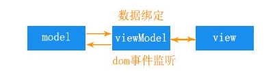

# MVC与MVVM的区别

### 1、MVC

> MVC(Model-View-Control)，即模型-视图-控制器，将用户对view的操作交给control处理，在control中响应view的事件调用model的接口对数据进行操作，一旦model发生变化便通知相关视图进行更新。C指的是页面业务逻辑。使用MVC的目的是将M和V的代码分离，MVC是单向通信，即View跟Model必须通过Control来承上启下。

对于仅有原生的html+js，MVC模式可以将html看成view，js看成control，负责处理用户与应用的交互，响应对view的操作（对事件的监听），调用model对数据进行操作，完成model与view的同步。

### 2、MVVM

>MVVM（Model-View-ViewModel）【Model】指的是后端传递的数据；【View】指的是所看到的页面；【ViewModel】它是链接view、model的桥梁，是mvvm的核心。

> 【ViewModel】有两个方向：（1）通过数据绑定的方式，将后端传递的数据转化成我们所呈现的页面，即model转化成view；（2）通过DOM事件监听的方式，将所呈现的页面转化成后端的数据，即view转化成model。这两个过程称为数据的双向绑定。

在MVVM框架下，视图和模型是不可直接通信的，他们必须通过ViewModel来通信，ViewModel通常要实现一个observer观察者，当数据发生变化，ViewModel能够监听到数据的这种变化，然后通知到对应的视图做自动更新，而当用户操作视图，ViewModel也能监听到视图的变化，然后通知数据做改动，这就实现了数据的双向绑定。

在vue中：Model:指的是js中的数据，如对象，数组等等；View:指的是页面视图；viewModel:指的是vue实例化对象。

### 3、区别

- MVVM实现了view与model的自动同步；
- 在MVC里，view可以直接访问model，但是MVVM是不可以的；
- MVVM的ViewModel 通过双向数据绑定把 View 层和 Model 层连接了起来，而View 和 Model 之间的同步工作完全是自动的，无需人为干涉。