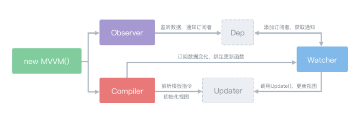

# vue数据双向绑定原理

### 1、vue双向绑定基本原理

vue.js是采用数据劫持&发布-订阅模式，通过Object.defineProperty()来劫持各个属性的setter、getter，在数据变动的时候发布消息给订阅者，触发相应的监听回调。

### 2、vue原理

- Observer数据监听器：采用Object.defineProperty()对vue数据对象的所有属性实现数据劫持，利用setter、getter对数据进行监听，当数据发生变化时通知订阅者，订阅者会触发update方法，对视图进行更新。
- Compiler指令解析器：将各种指令解析成真正的html。
- Watcher订阅者：关联Observer和Compiler，能够订阅并收到属性变动的通知，触发update方法，对视图进行更新。

### 3、总结

- 为vue的每个属性用Object.defineProperty()实现数据劫持，为每个属性分配一个订阅者集合dep；
- 在编译的时候在该属性的数组dep中添加订阅者；
- 订阅者在接到通知时，循环遍历数组并调用各订阅者的update方法更新视图。